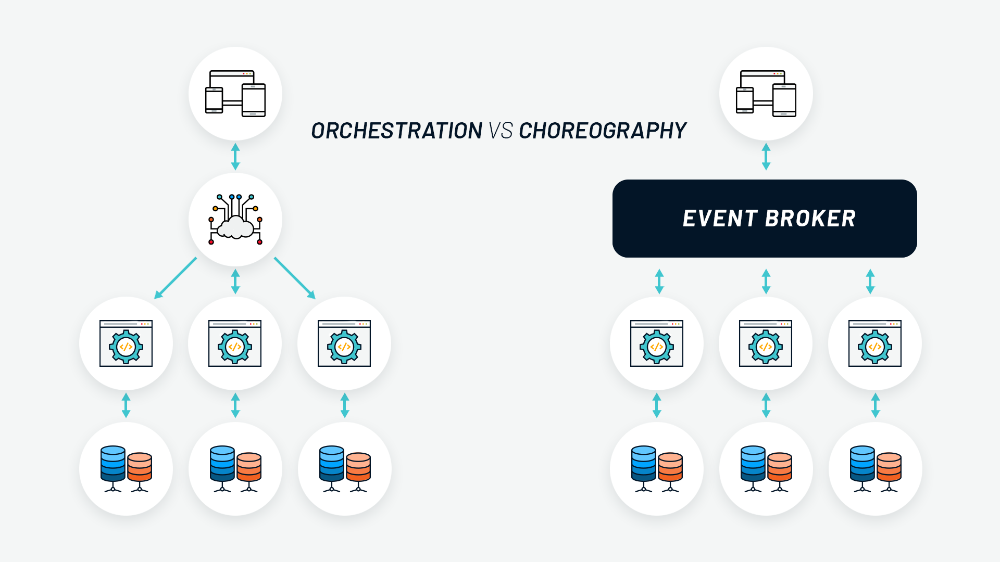
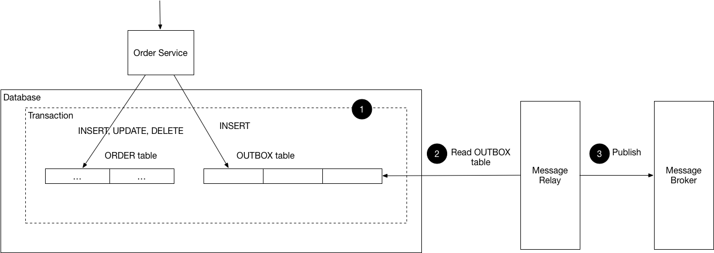

# software-designs-patterns
Welcome to the Software Architecture Implementation project! This project explores and implements various software architecture patterns and principles to build scalable, maintainable, and efficient systems. The aim is to demonstrate how different architectural approaches can be applied to real-world scenarios and to provide a reference implementation for these concepts.
## Event driven architecture (ranking)

This architecture enables asynchronous communication between applications using a publisher-subscriber model event broker, leading to effective decoupling of components. In this setup, every significant action within the application is represented as an event. It is crucial for the programmer to determine when and which events should be published and subscribed to ensure proper system functionality and responsiveness.

PROS  | CONS
------------- | -------------
Any subscriber has access to the event to use as it pleases	| Not Everything is up-to-date
Scalability: Promotes loose coupling and allows independent scaling |	Complexity: Designing and implementing can be complex
Responsiveness: Real-time or near-real-time processing improves user experience |	Event Handling Overhead: Asynchronous processing can introduce latency
Flexibility: Easy to integrate new services and adapt to changes	| Event Management: Challenges with ordering and duplication of events
Fault Tolerance: Isolates failures and improves system resilience |	Testing Challenges: Difficulties with integration and end-to-end testing
Simplified Communication: Reduces need for direct service-to-service calls | Infrastructure Requirements: Needs message brokers or event streaming platforms

The Ranking Application tracks all movies played throughout the day and ranks them based on the number of plays. Each time a user hits play on a movie, an event is generated and recorded. At the end of the day, the application compiles this data to produce a ranking of the most-watched movies.
It is implemented with java events producer and subscribers, but it should be a bus broker, such as kafka, SQS and others.

## Choreography and Orchestration Pattern(Olympics Medal)

### Orchestration
The Orchestration is a design pattern in distributed systems where a central orchestrator controls and manages the execution flow of multiple services or components through a event broker such as **kafka, sqs, RabbitMQ**.

| PROS | CONS                                                                                |
|------------|-------------------------------------------------------------------------------------|
| Centralized control – Ensures clear visibility and coordination. | Single point of failure – If the orchestrator fails, the entire workflow may break. |
| Simplified error handling – The orchestrator can manage retries and compensations. | Tight coupling – Services rely on the orchestrator, reducing flexibility.           |
| Scalability – Easier to scale individual services while keeping workflow intact. | Bottlenecks – Can slow down execution due to centralized coordination.              |

### Choreography
The Choreography Pattern is a distributed system design pattern used to manage interactions between microservices without relying on a central orchestrator. Instead of a single service directing the workflow, each microservice reacts to events and independently executes its tasks.

| PROS                                                     | CONS                                                                      |
|----------------------------------------------------------|---------------------------------------------------------------------------|
| Services are independent and modular.                    |  Hard to trace the flow of events.                 |
| No central bottleneck.                                   |  No clear sequencing.             |
| Failures don’t bring down the system.                    | Delays in data synchronization.         |
| Easily add new services without modifying existing ones. | High network traffic due to event passing. |

## Outbox Pattern (outbox-pattern-event) 

### **Outbox Pattern - Overview**

The **Outbox Pattern** is used in **event-driven architectures** to ensure reliable message delivery when using a **relational database** (e.g., PostgreSQL, MySQL) and an **event broker** (e.g., Kafka, RabbitMQ). in the example I used the event publisher from spring, but ideally should be the ones mentioned

#### **How It Works:**
1. A service writes an **event** to an "outbox" table **within the same database transaction** as the business operation (e.g., inserting an order).
2. A separate process (**poller**) reads new records from the outbox table and publishes them to an event broker.
3. Once published, the event can be deleted or marked as processed. (I would rather mark as processed than deleting it)

| **Pros**                                                                                                                  | **Cons** |
|---------------------------------------------------------------------------------------------------------------------------|----------|
| **Atomicity & Consistency** - Events and business data are saved in the same database transaction, avoiding inconsistencies. | **Requires Polling or Change Data Capture (CDC)** - You need a mechanism to pick up and publish the events, adding complexity. |
| **Resilience to Failures** - If an event broker is down, messages are still stored in the database and can be retried.    | **Increased Latency** - Polling introduces a small delay between writing and processing events. |
| **Guaranteed Message Delivery** - Ensures that events are reliably published.                                             | **Additional Storage Overhead** - Outbox events accumulate in the database until they are processed and deleted. |
| **Works with Relational Databases** - No need for distributed transactions; integrates well with existing systems.        | **Scalability Considerations** - A high volume of events may require optimized indexing and cleanup strategies. |
| **Supports Idempotency** - The outbox event table can track already processed events, preventing duplicate messages.      | **More Moving Parts** - Requires monitoring and managing an event processor in addition to the main service. |
